# Theory of Artificial Inteligence

AI is the current buzzword. It is used for detecting spam, driving cars autonomously, help students with their homework (American Psychological Association, 2023) and their teachers to detect who used it to plagiarize (NPR 2023), generating art (or rather, copying) (Slate 2023), and even to imitate the voice of the current pop singers (New York Times 2023). There is a huge hype around AI, and it has become an integral part of the current world, and it won’t stop here. In the future, there’s promises of a world of self-driving cars (IDTechEx 2021), automated work (Futurism 2017) and intelligent assistants by 2050. But AI is not something new. It had been already theorized as early as the 40’s, by figures such as Alan Turing, who considered the question “Can Machines Think?” (Turing 1950).It started gaining traction by 1956, when John McCarthy organized a workshop devoted to exploring these ideas (Russell and Norvig 2020). Many of the participants of this workshop went on to become pioneers in the field. Many of the concepts used within AI were created very early on, but it wasn’t until the era of Big Data and advancements in computing power, that it would really take off (Russell and Norvig 2020). AI can be defined as intelligent, human-like, behavior displayed by machines, referred to as “intelligent agents”, that intents to take the best possible action in a given situation (Russell and Norvig 2020). It is a general field that encompasses Machine Learning, Deep Learning and other subfields, as seen on Fig. 1.1.

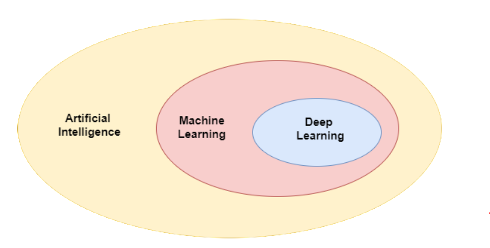

Figure 1.1: Artificial Intelligence vs Machine Learning vs Deep Learning (Roy 2020)

## Machine Learning

Machine Learning (ML) is a subset of AI that uses learning algorithms to create systems that learn from data, without fixed rules, but rather learning from experience. As Mitchell 1997 puts it, “A computer program is said to learn from experience E with respect to some class of tasks T and performance measure P, if its performance at tasks in T, as measured by P, improves with experience E.”. For example, a computer might learn how to distinguish languages by looking at various examples of different ones. ML can be categorized in its three types of learning:

- **Supervised learning**: consists of datasets containing features, with associated labels. The algorithm should then be able to classify each input according to the features
given;
- **Unsupervised learning**: consists of datasets containing features but no associated labels. The algorithm should find what those features are, by means of clustering the
data;
- **Reinforcement learning**: these algorithms do not have fixed datasets, but interact with an environment, creating a feedback loop: the agent is rewarded for good behavior and punished for bad behavior.

## Deep Learning

DL is a subfield of ML, in which the learning models use multiple successive layers, for increased complexity, contrasting with *shallow learning* machine learning models that only use one layer (Chollet, 2021). By incorporating multiple layers, deep learning models have the capability to extract and analyze more intricate patterns and representations from data. DL is used today for tasks such as image classification, object recognition, speech synthesis, image synthesis, machine translation, and others. The basic building block of deep learning is the Neural Network (NN), represented in Fig. 1.2, a data structure vaguely inspired by the human brain, that consists of different **nodes**, or units, organized in layers stacked on top of each other (Russell and Norvig, 2020). There are usually three parts in a NN: the **input layer**, the **hidden layers**, and the **output layer**. The NNs take data as input, train themselves to recognize patterns in the data in the hidden layers, and output (hopefully useful) predictions.

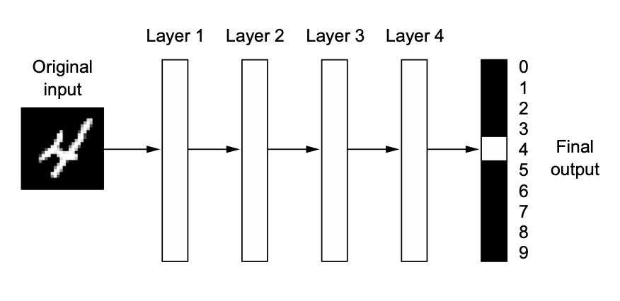

Figure 1.2: Neural Network (Chollet 2021)

The behavior of the NN is defined by its **parameters**, i.e., values that control the behavior of the system (Goodfellow, Bengio, and Courville 2016). These are internal to the algorithm and not defined manually. Whereas for a linear regression algorithm these are the coefficients, for NNs these are its weights and biases. 

The **weights** are values in the connections between nodes, that represent the importance of the respective inputs to the output - the higher the value, the more important they are. The **biases** are constants that allow the activation function shifting to the right/left, so that, even if the inputs are all zero, the output won’t be zero.

The procedure, represented in Fig. 1.3 in a node is as follows:

- Inputs are fed into the node;
- Weights are multiplied to each input;
- The results of the multiplications are summed;
- The bias is added;
- An activation function is applied to determine output.

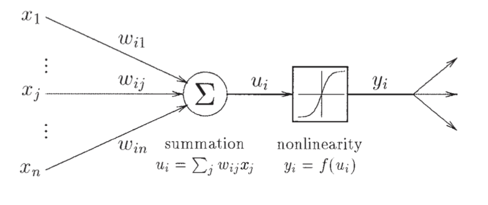

Figure 1.3: Neural Network Node (Reed and Marks 1998)

The node’s output is, then, determined by the application of a given activation function to the weighted sum of its inputs plus a bias. Given a weight *w*, an input *x* , a bias *b* and an activation function *f* , the output y might be represented as

$$
y_i = f(\sum_iw_ix_i + b)
$$

Activation functions introduce non linearity to the network. There are multiple activation functions that can be used (Russell and Norvig 2020):

**Sigmoid**

$$
\sigma(x) = \frac{1} {1 + e^{-x}}
$$

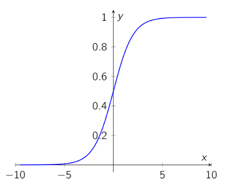

Saturates to 0 when x becomes very negative and saturates to 1 when x becomes very positive, leading to the Vanishing Gradient problem, i.e., the gradient becomes so small making it difficult to know which direction the parameters should move to improve the cost function (Goodfellow, Bengio, and Courville 2016)

**Tanh**

$$
tanh(x) = \frac{e^{2x} - 1}{e^{2x} + 1}
$$

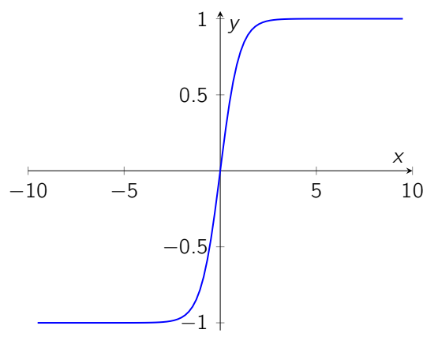

Similar to sigmoid, but can typically perform better (Goodfellow, Bengio, and Courville 2016)

**ReLU**

$$
Relu(x) = max(0, x)
$$

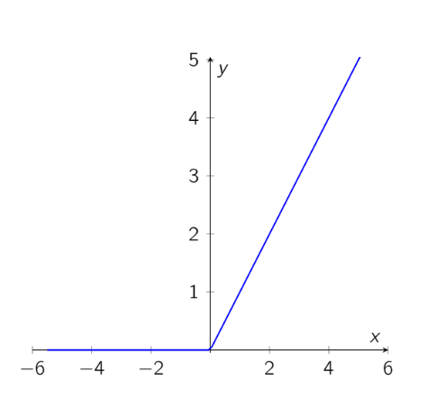

It is linear for half of its input domain, which preserves many of the properties that make linear models easy to optimize with gradient-based methods. In modern NNs it is the default recommendation (Goodfellow, Bengio, and Courville 2016). One potential disadvantage is the Dying ReLU problem, i.e., when the gradient is 0 and thus the weights are not adjusted, no matter the input (Maas 2013).

**Leaky ReLU**

$$
leaky\_relu(\mathbf{x}) = max(\beta*\mathbf{x}, \mathbf{x})
$$

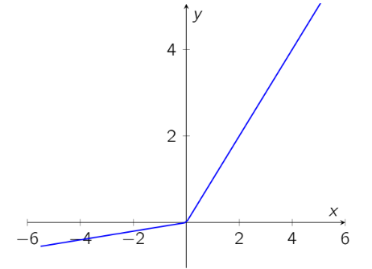

It is an extension of the ReLU function, trying to mitigate the Dying ReLU problem by allowing negative values.

The **learning process** consists of two phases: Forward Propagation and Backward Propagation.

In **Forward Propagation**, the information flows from the input layer to the output layer, resulting in predictions. Initially, the NN is initialized with random parameters, and so the predictions will not be that good. The goal is then to find a set of values for the weights and biases that lead to the best results. To calculate the performance of the model, loss functions are used. Loss functions take the predictions of the network and compute its deviation from the expected output, resulting in a loss score (Chollet 2021). If the predictions deviate too much from the expected results, the loss function results in a large number. The goal is to lower the loss score as much as possible. That’s where Backward Propagation comes in.

**Backward Propagation** is the reverse of Forward Propagation: information flows from the output layer to the input layer. Backward Propagation is how the NN learns, evaluating its own performance, using loss functions, and adjusting the the values of the weights and biases accordingly. This is done through the optimizer, which implements the algorithm to adjust the values of the weights and biases. The process of the training loop is represented in Fig. 1.4. For each iteration through the training set, also called epoch, the parameters get updated, and the model gets better at predicting the expected output (Chollet 2021).

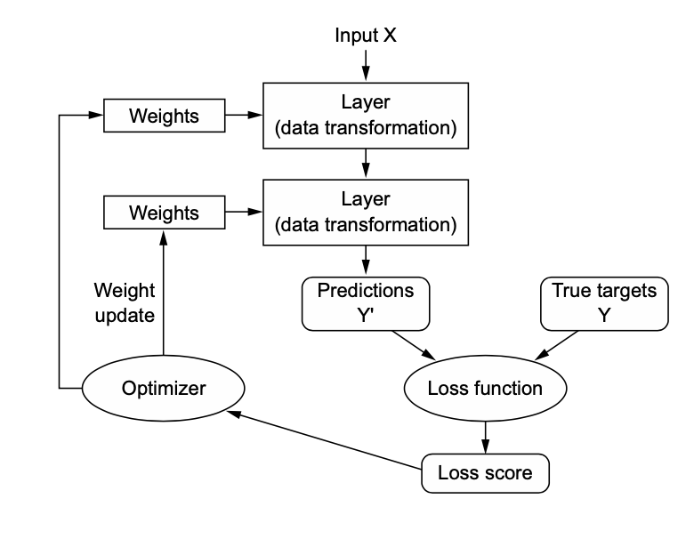

Figure 1.4: Training Loop (Chollet 2021)

## Loss Functions

As seen before, loss (or cost) functions are a vital component of how a NN learns, making it a very important design choice.
In the case of regression problems, the Mean Squared Error (MSE) is commonly used. For classification problems, the Cross Entropy loss function is commonly used.
In classification problems, the loss function employs the principle of maximum likelihood, meaning that the *cross-entropy* (a measure of dissimilarity) between the true distribution of class labels (training data) and the model’s predictions (predicted distribution) is used as the cost function (Goodfellow, Bengio, and Courville 2016).
To minimize the cross entropy, the output of the NN needs to be a probability. Specifically, in multiclass classification problems, the NN needs to output categorical distributions meaning that, for n classes, it needs to output n probabilities, all summing to 1. For that, a softmax layer is commonly used, which outputs a vector of nonnegative values that sum to 1 and accentuates differences in the outputs because of the used exponentials (Russell and Norvig 2020), as seen in the following equation:

$$
 \frac{e^{z_{i}}}{\sum_{j=1}^K e^{z_{j}}} \ \ \ for\ i=1,2,\dots,K
$$

For regression problems, where the target value is continuous, a linear output layer (without any activation function) is commonly used (Russell and Norvig 2020).

## Optimizers

Optimizing is a process very closely related to the cost function. The goal is to make small adjustments to the parameters, based on the output of the loss function, to try and minimize it. 

A typical algorithm used as optimizer is the **Gradient Descent**. In Gradient Descent, the weight starts at a random point, and the estimate of the gradient is computed, moving a small amount in the steepest downhill direction, repeating it until it converges at a minimum loss (Russell and Norvig 2020). While the goal is to reach the global minimum, it is possible to get stuck in a local minimum.
The step size for the movement is called the **learning rate**, which can be a constant, or decay over time. When it is too small, convergence might be very slow. When it is too large, convergence might never happen, as it might jump between one side of the valley to another (Reed and Marks 1998), as seen in Fig. 1.5.

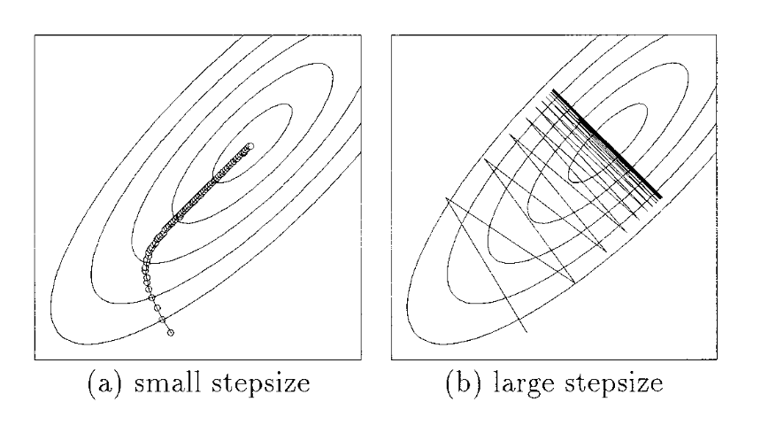

Figure 1.5: Gradient Descent with: a) Small learning rate; b) Large learning rate (Reed and Marks 1998)

A faster variant of the Gradient Descent is the Stochastic Gradient Descent (SGD), which randomly selects a small subset of the training data for each step, reducing the needed amount of computation (Russell and Norvig 2020). SGD also uses the concept of momentum, which accumulates an exponentially decaying moving average of past gradients and continues to move in their direction (Goodfellow, Bengio, and Courville 2016), as seen in Fig. 1.6.

There are other optimizers commonly used, such as Adagrad, Adam or RMSPROP, which will not be explored here.

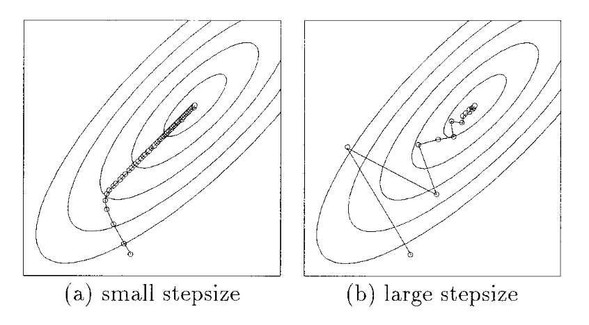

Figure 1.6: Gradient Descent with momentum: a) Small learning rate; b) Large learning rate (Reed and Marks 1998)

## Epochs, Batches and Iterations

Usually the learning process occurs multiple times, as the NN learns more for each time it runs through the training examples. Each such pass is called an **epoch** (Reed and Marks 1998).
The number of required epochs depends on the size of the dataset. When the dataset is too large, it might be too computationally heavy to do a pass for all the data at the same time. For that reason, it is common to divide the training data in **batches**, with a given size of training examples. It is then common to refer to epochs as the pass through the full training set, and iterations as the passes through each batch.

## Hyperparameters

Whereas parameters are internal values of the NN, that are not defined manually, *hyperparameters* are settings defined by the user to control the behavior of the learning algorithm (Goodfellow, Bengio, and Courville 2016), i.e., they are like little knobs that are adjusted to
improve the performance of the model, until the best values are found.

Some examples of hyperparameters are the number of epochs, the learning rate, the momentum, the loss and activation functions, the number of batches, the batch size, etc.

## Neural Network Architectures

This subsection delves deeper into some NN architectures and its characteristics.

### Fully-Connected Feed Forward

Fully-Connected Feed-Forward (FCFF), also called Multi Layer Perceptron (MLP), is the quintessential NN model (Goodfellow, Bengio, and Courville 2016). It describes a directed acyclic graph with designated input and output nodes, where the information flows from the inputs to the outputs.

### Recurrent Neural Networks

Recurrent Neural Networks (RNN), such as the Long Short-Term Memory (LSTM), allow cycles in the graph, which makes it possible to have internal memory, by creating feedback loops in its hidden layers (Russell and Norvig 2020). It is good for processing sequential
data, such as text. 

Some applications of RNNs are Natural Language Processing, Sentiment Analysis, DNA sequence classification, Speech recognition and Language Translation.

### Convolutional Neural Networks

When it comes to classification problems, like classifying an image, it quickly becomes impractical to use FCFF NNs. When it comes to images, pixel adjacency matters, whereas in FCFF the same result would be obtained even if the pixels were all sorted. Besides, given
that the FCFF is fully connected, it would be easy to see that it would result in a huge number of parameters (Russell and Norvig 2020). For example, for a small image of size 200x200x3 (200 wide, 200 high, 3 color channels) the regular FCFF would have 200x200x3=120000 weights, which is already an unfeasible and wasteful number of weights.

Convolutional Neural Network (CNN), represented in Fig. 1.7, is a type of NN that revolutionized the field of computer vision. It is good for processing data with grid-like topology (Goodfellow, Bengio, and Courville 2016), like images and videos.

There are three main types of layers used: **convolutional layers**, **pooling layers** and **Fully-Connected layers**.

Figure 1.7: Convolutional Neural Network Architecture (Stanford 2023)

The **convolutional layer**, which gives its name to the architecture type, uses an operation called convolution, a mathematical operation represented in Equation 2.3, in which the first argument x is referred to as the input and the second argument w is referred to as the kernel or filter, and the output, sometimes referred to as feature map, is the dot product of these two.

$$
s(t) = (x \cdot w)(t)
$$

Usually the kernel dimensions are in odd numbers to center on a pixel, with some typical dimensions being 3x3x3 (3 wide, 3 high, 3 color channels) or 5x5x3 (5 wide, 5 high, 3 color channels). On a forward pass, the kernel slides across width and height of the input volume and computes dot products between the entries of the filter and the input at any position (Stanford 2023).

**Pooling** layers, represented in Fig. 1.8, are usually inserted in between Convolutional Layers. Its purpose is to gradually diminish the spatial dimensions of the representation, reducing the number of parameters and hence the computational load.
The most common pooling operations are: max pooling (computing the maximum value of its n inputs); and average pooling (computing the average value of its n inputs) (Stanford 2023).

Figure 1.8: Pooling Layer (Stanford 2023)

The CNN then ends with a fully connected layer to compute the class scores.

### Convolutional Neural Network Architectures

The history of CNNs started with LeNet, proposed by LeCun et al. 1998, used for handwritten digit identification. Albeit effective, due to its small size, it could not scale well to all image classes.

From then until the 2010’s, the area of CNNs stagnated, as hardware limitations were big. But two factors helped revive it: the launching of the CUDA programming platform by NVIDIA, which unleashed parallel processing capabilities of Graphics Processing Unit (GPU) even more (Lindholm et al. 2008), and the release of the ImageNet dataset by a group at Stanford (Deng et al. 2009), a large dataset of images, coupled with the launching of the ImageNet Large Scale Visual Recognition Challenge (ILSVRC), which strengthened research in the field.
In 2012, Krizhevsky proposed AlexNet (Krizhevsky, Sutskever, and Hinton 2012), a deep CNN that resulted in big advancements for computer vision. It was trained with the ImageNet dataset and two GPUs (NVIDIA GTX 580) were used for parallel training. This resulted in
a drop in the test error from 25.8 to 16.4. The positive results sparked a spike in innovation, and in the following years, many advances were made by participants of the ILSVRC by attempting to overcome the shortcomings of the previous models by adopting various depth and parameter optimization strategies. Some of these were the VGG (Simonyan and Zisserman 2014), that reduced the error to 7.3, GoogleNet (Szegedy, Liu, et al. 2014), that reduced the error to 6.7, Inception-V3 (Szegedy, Vanhoucke, et al. 2015), that reduced the error to 3.5 (surpassing human capabilities) and ResNet (He et al. 2015), that reached an incredible 3.57 in test error. The evolution of CNNs has been linked with an increase in complexity and thus computational power requirements. The challenge has been to mitigate this, improving performance whilst reducing the needed computational resources. Some attempts at that are MobileNet (Howard et al. 2019), a lightweight CNN architecture intended for mobile devices, and Vision Transformer (ViT) (Dosovitskiy et al. 2021), that takes advantage of the Transformer architecture (Vaswani et al. 2017), the de-facto standard for natural language processing tasks, and applies it to computer vision tasks, which has shown to reduce the computational load.

## Transfer Learning

A big part of training a ML model is gathering and selecting the data. But when it is scarse, it is not that easy. One possible strategy to mitigate this is to use transfer learning. In transfer learning, experience with one learning task helps an agent learn better on another task (Russell and Norvig 2020). For example, it is easier for a third year student of computer engineering to learn about Deep Learning than for a 10 year old. 

The popularity of transfer learning is due to the availability of high quality pretrained models, which can be finetuned for different tasks, such as ResNet.

Usually the first few layers are frozen, acting as feature extractors, allowing only some parameters to be modified. However, sometimes this is not enough, and the whole model might need to be finetuned.

## Generalization

The biggest challenge in training a NN (or any ML model) is generalization, i.e., to make it perform well on never previously seen examples, and not just on the training set (Goodfellow,
Bengio, and Courville 2016).
Two problems may arise: *underfitting*, when the model can’t obtain a low error value on the training set (meaning it can’t find patterns in the data); and *overfitting*, when the gap between the training error and the test error is too large (meaning the model has memorized the training data (Goodfellow, Bengio, and Courville 2016). The goal is to find the optimal point.
To find this optimal point, it is recommended to split the dataset in three different sets: the training dataset to train candidate models, with different hyperparameters; the validation set, to evaluate the candidate models and choose the best one; and a test set, to evaluate how well it generalizes (Russell and Norvig 2020). The test set should never be used for model selection, since the model should be totally impartial to the test data. Its use for model selection would invalidate its categorization as test set, and instead it would be called a second validation set. The holdout split ratio between the sets is a bit of a trial and error challenge but, usually, it should be about 80% of the training data for training and 20% for testing and, from the training set, also around 80% for the training, and 20% for validation.

This works well with a lot of data, but if there isn’t much data, it can be problematic. A technique called *crossvalidation* can be used, from which the most well known is the **k-fold cross validation**, in which the dataset is split into k subsets. Each of these subsets will be used as the validation set for k rounds of learning, while the rest of the data will be used as training data. Some commonly used k values are 5 and 10 (Russell and Norvig 2020).

Another problem that can occur is that of class imbalance, i.e., having more examples from certain classes than others. This might bias the model into identifying the majority classes and ignore the minority. If the split ratio is done randomly, then the validation set might have few examples of the minority class, affecting the metrics and, thus, possibly giving a false impression of the model’s performance. The solution is using **stratified sampling**, in which the population is divided into homogenous groups, to guarantee that the test set is representative of the overall population (Gron 2017).

## Performance Metrics

Performance metrics are very useful to evaluate the generalization of the trained model and aid in the selection of the best one.

When it comes to classification problems, many of the metrics are based on the confusion matrix, as seen in Fig. 1.9, in which the rows represent the predicted classes, while the columns represent the actual classes. Usually the matrix is used to represent binary classification, but it can just as easily be used for multi-class classification.

Figure 1.9: Confusion Matrix (Narkhede 2018)

Some of the most common metrics for classification problems are (Hossin and M.N 2015):

**Accuracy**: Measures the ratio of correct predictions over the entire set of data evaluated. It’s one of the most popular metrics.

$$
\frac{tp + tn}{tp + fp + tn + fn}
$$

**Recall/Sensitivity**: Measures the proportion of positives that were correctly classified. It is useful when there is a high cost associated with False Negatives.

$$
\frac{tp}{tp + fn}
$$

**Precision**: Measures the proportion of positives that were correctly predicted from the total positives. It is useful when there is a high cost associated with False Positives.

$$
\frac{tp}{tp + fp}
$$

**Balanced Accuracy**: Measures the ratio of correct predictions over the entire set of data, corrected for unbalanced distributions of classes (Grandini, Bagli, and Visani 2020). It is equal to the macro-averaged recall function.

$$
\frac{1}{n}\sum_{i=1}^n \frac{tp_i}{tp_i + fn_i}
$$

**F1 Score**: The F1 score is the harmonic mean of precision and recall. It provides a single metric that balances both precision and recall.

$$
\frac{2 * precision * recall}{precision + recall}
$$

## Regularization

There’s a tradeoff between the complexity of a model and its performance. When a model is too simple, it has a tendency to underfit the data, whereas if it is too complex it has a tendency to overfit it. A central concern in ML is to find the balance in this tradeoff, preferring simpler models to more complex ones, given they perform equally well (Reed and Marks 1998). Regularization techniques are a set of practices that attempt to address this problem, by modifying the model to reduce its generalization error but not its training error (Goodfellow, Bengio, and Courville 2016).

Some commonly used techniques are:

- **Dropout**: In each training epoch, nodes are randomly dropped, creating a new version of the NN. The dropped nodes will not be part of the forward and backward passes in the training process, but will be included in the test process (Russell and Norvig 2020).
- **Data augmentation**: the more data there is, the better the model will generalize. Unfortunately data is limited, so multiple versions of each image can be created by performing transformations such as rotating, translating, cropping, scaling or adding noise.
- **Early Stopping**: Generalization can vary during the training process. The validation set error may decrease, and then increase again as it starts to overfit. This technique monitors the error and stops the training when the minimum is found. One should be careful with this technique though, as it can cause the training to stop too soon (Bishop 2006).
- **Batch normalization**: improves the rate of convergence of SGD by normalizing the outputs of each layer, i.e., standardizing the mean and variance of the values (Russell and Norvig 2020).
- **Weight decay**: It is a subtype of L2 regularization, and consists of adding a penalty to the loss function used to train the model, favoring smaller weights over larger ones, to avoid sharp transitions in the node functions (Reed and Marks 1998).

## Deep Learning Frameworks

DL frameworks allow the abstraction of the complexity of DL, to make it simple to create production-ready applications. Three of the most known of are: Tensorflow, Keras and Pytorch.

**Tensorflow** is a Python deep learning framework created by Google in 2015, that allows running large NNs by distributing the computation through multiple GPUs (Gron 2017). It is used in multiple large-scale applications by companies such as Airbnb, CocaCola and Google itself (TensorFlow 2023). 

**Keras** is a high level API to make it simpler to work with Tensorflow.

**Pytorch** is an open source deep learning framework, created by Facebook in 2016. It is used by companies such as Amazon, Lift, and Facebook (Pytorch 2023a).

Although this is changing, TensorFlow is still considered the standard when it comes to industry professionals, partly due to its in-built deployment tool, TensorFlow Serving, which facilitates the deployment of TensorFlow models, and Tensorflow.js, a javascript library to deploy ML models on the web and mobile. On the other hand, Pytorch has become more popular in research-oriented communities, due to its syntax, which is more pythonic than TensorFlow, making it easier to understand (Pointer 2019).

However, Pytorch is catching up to the industry, with their deployment tool, TorchServe, and mobile API, Pytorch Mobile, which is still in its Beta stage (Pytorch 2023b). As seen in Fig. 1.10 google trends, there’s been an increasing interest in Pytorch.

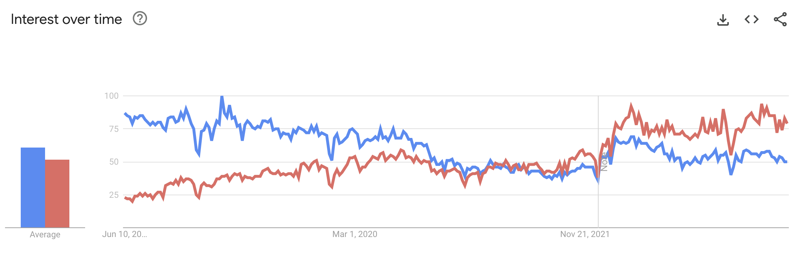

Figure 1.10: Pytorch (red) vs Tensorflow (blue) (Google Trends 2023)

# References

American Psychological Association, APA – (Mar. 2023). How to use ChatGPT as a learning tool. Available at https://www.apa.org/monitor/2023/06/chatgpt-learning-tool. (Accessed on 26/04/2023).

Bishop, Christopher M. (2006). Pattern Recognition and Machine Learning (Information Science and Statistics). Berlin, Heidelberg: Springer-Verlag. isbn: 0387310738.

Chakraborty, Pranamesh et al. (2018). “Traffic Congestion Detection from Camera Images using Deep Convolution Neural Networks”. In: Transportation Research Record 2672.45, pp. 222–231. doi: 10 . 1177/0361198118777631. url: https://doi.org/10.1177/0361198118777631.

Chollet, François (2021). Deep Learning with Python. 2nd ed. Manning.

Deng, Jia et al. (June 2009). “ImageNet: A large-scale hierarchical image database”. In: 2009 IEEE Conference on Computer Vision and Pattern Recognition(CVPR). Vol. 00, pp. 248–255. doi: 10.1109/CVPR.2009.5206848. url: https://ieeexplore.ieee.org/abstract/document/5206848/.

Dosovitskiy, Alexey et al. (2021). An Image is Worth 16x16 Words: Transformers for Image
Recognition at Scale. arXiv: 2010.11929 [cs.CV].

Futurism (Jan. 2017). New Study Predicts Nearly Half of All Work Will Be Automated. Available at https://futurism.com/new-study-predicts-nearly-half-of-all-work-will-be-automated. (Accessed on 26/04/2023).

Girshick, R. et al. (2014). “Rich Feature Hierarchies for Accurate Object Detection and Semantic Segmentation”. In: 2014 IEEE Conference on Computer Vision and Pattern Recognition (CVPR). Vol. 00, pp. 580–587. doi: 10.1109/CVPR.2014.81. url: https://ieeexplore.ieee.org/abstract/document/6909475/.

Girshick, Ross (2015). Fast R-CNN. arXiv: 1504.08083 [cs.CV].

Goodfellow, Ian J., Yoshua Bengio, and Aaron Courville (2016). Deep Learning. http://www.deeplearningbook.org. Cambridge, MA, USA: MIT Press.

Google Trends (2023). Google Trends: Tensorflow vs Pytorch. Available at https://trends.google.pt/trends/explore?date=today 5-y&q=tensorflow,pytorch. (Accessed on 15/06/2023).

Grandini, Margherita, Enrico Bagli, and Giorgio Visani (2020). Metrics for Multi-Class Classification: an Overview. arXiv: 2008.05756 [stat.ML].

Gron, Aurlien (2017). Hands-On Machine Learning with Scikit-Learn and TensorFlow: Concepts, Tools, and Techniques to Build Intelligent Systems. 1st. O’Reilly Media, Inc. isbn: 1491962291.

He, Kaiming et al. (2015). Deep Residual Learning for Image Recognition. arXiv: 1512.03385 [cs.CV].

Hossin, Mohammad and Sulaiman M.N (Mar. 2015). “A Review on Evaluation Metrics for Data Classification Evaluations”. In: International Journal of Data Mining & Knowledge Management Process 5, pp. 01–11. doi: 10.5121/ijdkp.2015.5201.

Howard, Andrew et al. (2019). Searching for MobileNetV3. arXiv: 1905.02244 [cs.CV].

IDTechEx (Aug. 2021). Why Driving Will be Outlawed by 2050. Available at https://www.idtechex.com/en/research-article/why-driving-will-be-outlawed-by-2050/24622 (Accessed on 26/04/2023).

Krizhevsky, Alex, Ilya Sutskever, and Geoffrey E. Hinton (2012). “ImageNet Classification with Deep Convolutional Neural Networks”. In: Advances in Neural Information Processing Systems 25. Ed. by F. Pereira et al. Curran Associates, Inc., pp. 1097–1105. url: http://papers.nips.cc/paper/4824-imagenet-classification-with-deep-convolutional-neural-networks.pdf.

LeCun, Yann et al. (1998). “Gradient-Based Learning Applied to Document Recognition”. In: Proceedings of the IEEE. Vol. 86. 11, pp. 2278–2324. url: http://citeseerx.ist.psu.edu/viewdoc/summary?doi=10.1.1.42.7665.

Lindholm, Erik et al. (2008). “NVIDIA Tesla: A Unified Graphics and Computing Architecture”. In: IEEE Micro 28.2, pp. 39–55. doi: 10.1109/MM.2008.31.

Maas, Andrew L. (2013). “Rectifier Nonlinearities Improve Neural Network Acoustic Models”.

Mitchell, Tom M (1997). Machine learning. Vol. 1. 9. McGraw-hill New York.

Narkhede, Sarang (2018). Understanding Confusion Matrix. https://towardsdatascience.com/understanding-confusion-matrix-a9ad42dcfd62. [Accessed 18-Jun-2023].

New York Times, NYT – (Apr. 2023). An A.I. Hit of Fake ‘Drake’ and ‘The Weeknd’ Rattles the Music World. Available at https://www.nytimes.com/2023/04/19/arts/music/ai-drake-the-weeknd-fake.html. (Accessed on 26/04/2023).

NPR (Jan. 2023). A college student created an app that can tell whether AI wrote an essay. Available at https://www.npr.org/2023/01/09/1147549845/gptzero-ai-chatgpt-edward-tian-plagiarism. (Accessed on 26/04/2023).

Pointer, I. (2019). Programming PyTorch for Deep Learning: Creating and Deploying Deep Learning Applications. O’Reilly Media. isbn: 9781492045328. url: https://books.google.pt/books?id=udCwDwAAQBAJ.

Pytorch (2023a). Community Stories. Available at https://pytorch.org/community-stories. (Accessed on 23/05/2023).

– (2023b). Pytorch Mobile. Available at https://pytorch.org/mobile/home/. (Accessed on 03/05/2023).

Redmon, Joseph et al. (2016). You Only Look Once: Unified, Real-Time Object Detection.
arXiv: 1506.02640 [cs.CV].

Reed, Russell D. and Robert J. Marks (1998). Neural Smithing: Supervised Learning in Feed-
forward Artificial Neural Networks. Cambridge, MA, USA: MIT Press. isbn: 0262181908.

Ren, Shaoqing et al. (2016). Faster R-CNN: Towards Real-Time Object Detection with
Region Proposal Networks. arXiv: 1506.01497 [cs.CV].

Roy, Rupali (2020). Understanding the difference between AI, ML and DL. https://towardsdatascience.com/understanding-the-difference-between-ai-ml-and-dl-cceb63252a6c. [Accessed 17-Jun-2023].

Russell, Stuart J. and Peter Norvig (2020). Artificial Intelligence: A Modern Approach.
4th ed. Pearson.

Simonyan, Karen and Andrew Zisserman (2014). “Very Deep Convolutional Networks for
Large-Scale Image Recognition”. In: CoRR abs/1409.1556. url: http://arxiv.org/abs/1409.1556.

Slate (Mar. 2023). A.I. Is Sucking the Entire Internet In. What If You Could Yank Some Back Out? Available at https://slate.com/technology/2023/03/how-holly-herndon-and-mathew-dryhurst-brokered-an-a-i-deal-with-stable-diffusion.html. (Accessed on 26/04/2023).

Stanford (2023). CS231n Convolutional Neural Networks for Visual Recognition. Available at
https://cs231n.github.io/convolutional-networks/. (Accessed on 11/05/2023).

Szegedy, Christian, Wei Liu, et al. (2014). Going Deeper with Convolutions. arXiv: 1409. 4842 [cs.CV].

Szegedy, Christian, Vincent Vanhoucke, et al. (2015). Rethinking the Inception Architecture for Computer Vision. arXiv: 1512.00567 [cs.CV].

TensorFlow (2023). Case Studies and Mentions. Available at https://www.tensorflow.org/about/case-studies. (Accessed on 23/05/2023).

Turing, A. M. (Oct. 1950). “I.—Computing Machinery And Intelligence”. In: Mind LIX.236, pp. 433–460. issn: 0026-4423. doi: 10.1093/mind/LIX.236.433. eprint: https://academic.oup.com/mind/articlepdf/LIX/236/433/30123314/lix-236-433.pdf. url: https://doi.org/10.1093/mind/LIX.236.433.

Vaswani, Ashish et al. (2017). Attention Is All You Need. arXiv: 1706.03762 [cs.CL].