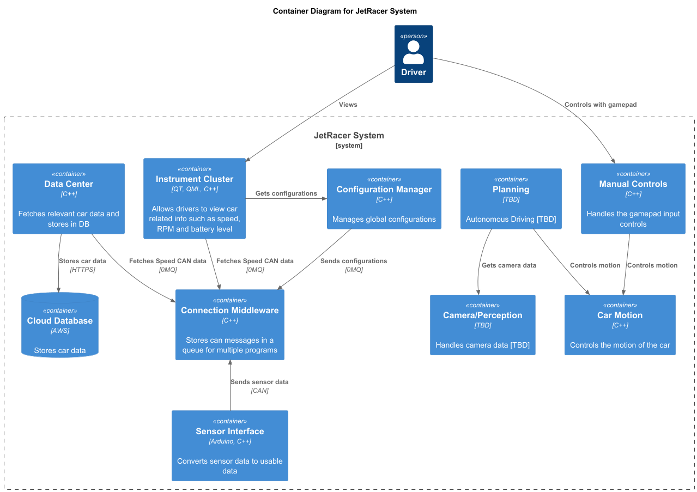

# Instrument Cluster Architecture

## Physical Layer

## Components

* Jetson NANO
* Arduino Uno R3
* RS485 CAN for Jetson Nano (MCP2515)
* MCP2515 CAN Module
* LM393 Speedsensor
* 7.9inch DSI LCD

## Logical View

### System (Level 1)

### Container (Level 2)

### Component (Level 3)

Car Motion

Communication Middleware

Instrument Cluster

## Physical View

## Process View

### Arduino

Incoming pulse

Speed calculation / can message

### COM - Middleware

### Instrument Cluster

