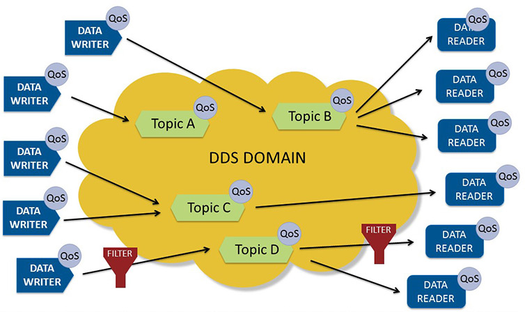

# Types of Inter-Process Communication

Inter-process communication (IPC) refers to the mechanisms by which processes in an operating system communicate with each other. Typically, applications can use IPC categorized as clients or servers. A *client* is an application or a process that requests a service from some other application or process. A *server* is an application or a process that responds to a client request. Many applications act as both a client and a server, depending on the situation [https://learn.microsoft.com/en-us/windows/win32/ipc/interprocess-communications].

In Linux, there are several IPC mechanisms available, each with its own advantages and disadvantages.

## Local IPC Methods

https://www.linkedin.com/pulse/brief-linux-ipc-amit-nadiger

### Shared Memory

Shared memory is a form of IPC that allows multiple processes to share a portion of memory. It is useful when you need to synchronize data between processes. Since multiple processes can access the shared memory simultaneously, synchronization techniques such as semaphores or mutexes can be used to prevent race conditions.

### Pipes

Pipes are a simple form of IPC that allow two related processes to communicate. Pipes can be either named or unnamed. Unnamed pipes are created with the **pipe()** system call and can only be used between related processes, such as a parent and child process. Named pipes, also known as FIFOs, are created with the **mkfifo()** system call and can be used between unrelated processes.

Pipes are useful when you need to transfer a small amount of data between two related processes. Since pipes are implemented using the kernel's memory, they are fast and efficient. Pipes can also be used to chain commands together in a shell script.

### Message Queues

Message queues are useful when you need to transfer a larger amount of data between processes, as message queues can hold more data than pipes. Message queues are also useful when you need to transfer data asynchronously. A process can write a message to a message queue and then continue with other tasks, while another process can read the message from the queue when it is ready.

### Semaphores

Semaphores are another type of IPC mechanism in Linux that allow processes to synchronize and coordinate their access to shared resources. Semaphores are implemented as a system resource in the kernel, and they can be used to control access to shared memory segments, files, and other resources. Semaphores can be used in a variety of scenarios, such as controlling access to shared memory segments, coordinating access to critical sections of code, or managing the flow of data between processes

### Sockets

Sockets provide point-to-point, two-way communication between two processes. Sockets are very versatile and are a basic component of interprocess and intersystem communication. A socket is an endpoint of communication to which a name can be bound. It has a type and one or more associated processes [https://users.cs.cf.ac.uk/dave/C/node28.html]. Uses the same primitives as the for the communications between computers in a network, but the kernel uses more efficient mechanisms for internal messages.

### D-Bus

D-Bus is a message bus system, a simple way for applications to talk to one another. In addition to interprocess communication, D-Bus helps coordinate process lifecycle; it makes it simple and reliable to code a "single instance" application or daemon, and to launch applications and daemons on demand when their services are needed. [https://www.freedesktop.org/wiki/Software/dbus/]

D-Bus supplies both a system daemon (for events such as "new hardware device added" or "printer queue changed") and a per-user-login-session daemon (for general IPC needs among user applications). Also, the message bus is built on top of a general one-to-one message passing framework, which can be used by any two apps to communicate directly (without going through the message bus daemon).

## Network Based IPC Methods

So far, the examples we have worked with have been run on the same workstation or host. However,
as we gain expertise with interprocess communication techniques, it becomes evident that there will
be many occasions when we will want to communicate with processes that may reside on different
workstations. These workstations might be on our own local area network or part of a larger wide area network. In a UNIX-based, networked computing setting, there are several ways that communications of this nature can be implemented.

### Sockets

Just as pipes come in two flavors (named and unnamed), so do sockets. IPC sockets (aka Unix domain sockets) enable channel-based communication for processes on the same physical device (*host*), whereas network sockets enable this kind of IPC for processes that can run on different hosts, thereby bringing networking into play. Network sockets need support from an underlying protocol such as TCP (Transmission Control Protocol) or the lower-level UDP (User Datagram Protocol).

### Remote Procedure Calls (RPC)

RPC is an interprocess communication mechanism that enables data exchange and the invocation of functionality that resides in a different process. The different process can be on the same machine, on the local area network (LAN), or across the Internet. As a programming interface, RPCs are designed to resemble standard, local procedure (function) calls. The client process (the process making the request) invokes a local procedure commonly known as a client stub that contains the network communication details and the actual RPC.

### ZeroMQ

ZeroMQ (also known as ØMQ, 0MQ, or zmq) looks like an embeddable networking library but acts like a concurrency framework. It gives you sockets that carry atomic messages across various transports like in-process, inter-process, TCP, and multicast. You can connect sockets N-to-N with patterns like fan-out, pub-sub, task distribution, and request-reply. It's fast enough to be the fabric for clustered products. Its asynchronous I/O model gives you scalable multicore applications, built as asynchronous message-processing tasks. It has a score of language APIs and runs on most operating systems.

Repos:

https://github.com/zeromq/libzmq

## Middleware

Middleware is a software layer that provides a set of services and abstractions to enable interprocess communication in distributed systems. Middleware can provide a variety of services, including message queuing, transaction management, naming and directory services, and security services.

The middleware architectural style postulates the existence of a common request broker which mediates the usage of resources between different components. In automotive software, the middleware architecture is visible in the design of the AUTOSAR standard.

### Data Distribution Service (DDS)

Data Distribution Service (DDS) is an open-standard, data-centric communications software framework with more than a dozen commercial and open-source implementations. It provides low latency, extreme reliability, and a rich set of Quality of Service (QoS) controls to enable robust peer-to-peer communications in the most challenging of environments: contested battlefields, noisy industrial settings, wide-area networks, and remote systems with intermittent connectivity.

DDS has been used in thousands of critical systems, hundreds of autonomous-vehicle programs, and dozens of other frameworks and standards including ROS 2, AUTOSAR, and FACE.

DDS is uniquely **data centric**, which is ideal for the Industrial Internet of Things. Most middleware works by sending information between applications and systems. Data centricity ensures that all messages include the contextual information an application needs to understand the data it receives.

Repos:

https://github.com/OpenDDS/OpenDDS

### SOME/IP

SOME/IP is a middleware designed for service-orientated communication in distributed systems, commonly used in automotive networks. It enables efficient and scalable data exchange between different electronic control units (ECUs). SOME/IP is a key component of the AUTomotive Open System ARchitecture (AUTOSAR) standard, which ensures commonality between software architectures across the automotive industry. This helps to promote the interoperability and reusability of software components.

Furthermore, **vsomeip** is a specific implementation of the SOME/IP protocol, which facilitates integration and interoperability between different systems and components within an automotive environment.  The vsomeip library is an implementation of the AUTOSAR SOME/IP protocol. Built using C++ and developed within the BMW Group, it is a critical piece of software for modern automotive communication. It enables Unix Domain Socket (UDS) and Transmission Control
Protocol (TCP) communication between applications within the same device, and additionally, User Datagram Protocol (UDP) and TCP between multiple devices, ensuring seamless data transfer across
a vehicle's electronic systems.

Repos:

https://github.com/COVESA/vsomeip

### ROS/ ROS 2

The free, open-source ROS project is a one-stop shop for quickly creating robotics applications and systems. First released in 2010, the original ROS rapidly became popular in academia, eventually turning into the dominant framework for robotics researchers and educators.

ROS 2 is a redesign of the original ROS that should help solve emerging challenges in robotics. Built on top of the DDS framework, ROS 2 seeks to operate in constrained systems, multi-robot swarms, and production-grade platforms—an ideal marriage that combines the outstanding tools and packages of ROS with the “works everywhere” capabilities of DDS. ROS 2 has helped ROS break out of academia.

Because ROS 2 is layered on top of DDS, any data sent or received within ROS 2 must travel through these layers before reaching the underlying DDS framework. This takes a substantial amount of time. By designing critical application components to directly use the underlying DDS API, engineers can eliminate many performance bottlenecks. [https://www.electronicdesign.com/markets/automation/article/21258792/real-time-innovations-rti-ros-and-dds-making-the-most-out-of-your-software-framework]

Repos:

https://github.com/ros2/examples

## AUTOSAR

AUTOSAR (Automotive Open System Architecture) can be defined as a common platform for the whole automotive industry that is designed to enhance the scope of application for vehicle functionality without affecting the current operating model. [AUTOSAR](https://www.autosar.org/) is basically an open and standard software architecture which was jointly developed by automobile manufacturers, suppliers and tool developers. In this article we will learn what is AUTOSAR and about the different layers in its architecture.

The main motto of AUTOSAR is “Cooperate on standards, compete on implementation”. This unique architecture was developed in order to establish and maintain a common standard among the manufacturers, software suppliers, and tool developers so that the outcome of the process can be delivered without the need of any alteration

The AUTOSAR platform comes in two flavors – the **AUTOSAR Classic Platform** designed for the development of traditional mechatronics systems such as climate control and doors and the **AUTOSAR Adaptive Platform** designed for the development of modern automotive software systems in the area of, e.g., autonomous drive and connectivity.

The AUTOSAR Classic Platform [https://www.autosar.org/standards/classic-platform] architecture distinguishes on the highest abstraction level between three software layers which run on a microcontroller: application, runtime environment (RTE) and basic software (BSW).

- The application software layer is mostly hardware independent.
- Communication between software components and access to BSW via RTE.
- The RTE represents the full interface for applications.
- The BSW is divided in three major layers and complex drivers:
    - Services, ECU (Electronic Control Unit) abstraction and microcontroller abstraction.
- Services are divided furthermore into functional groups representing the infrastructure for system, memory and communication services.

The AUTOSAR Adaptive Platform [https://www.autosar.org/standards/adaptive-platform] implements the AUTOSAR Runtime for Adaptive Applications (ARA). Two types of interfaces are available, services and APIs. The platform consists of functional clusters which are grouped in services and the AUTOSAR Adaptive Platform Basis.

Functional clusters...

- assemble functionalities of the Adaptive Platform
- define clustering of requirements specification
- describe behavior of software platform from application and network perspective
- but, do not constrain the final SW design of the architecture implementing the Adaptive Platform.

Functional clusters in AUTOSAR Adaptive Platform Basis have to have at least one instance per (virtual) machine while services may be distributed in the in-car network.

In comparison to the AUTOSAR Classic Platform the AUTOSAR Runtime Environment for the Adaptive Platform dynamically links services and clients during runtime.

Some of the communication frameworks/protocols used by AUTOSAR are SOME/IP and DDS for AUTOSAR Adaptive Platform.

## Readings

The Linux Programming Interface by Michael Kerrisk

Interprocess Communications in Linux: The Nooks and Crannies by John Gray

https://www.iiconsortium.org/wp-content/uploads/sites/2/2022/06/IIoT-Connectivity-Framework-2022-06-08.pdf

https://criticalsoftware.com/multimedia/critical/en/yQa_1Afze-CSW_WhitePaper_Automotive_SOMEIP.pdf

https://mohitdtumce.medium.com/understanding-interprocess-communication-ipc-pipes-message-queues-shared-memory-rpc-902f918fba58

https://www.electronicdesign.com/markets/automation/article/21258792/real-time-innovations-rti-ros-and-dds-making-the-most-out-of-your-software-framework

Automotive Software Architectures by Miroslaw Staron

https://circuitdigest.com/article/understanding-autosar-and-its-architecture
